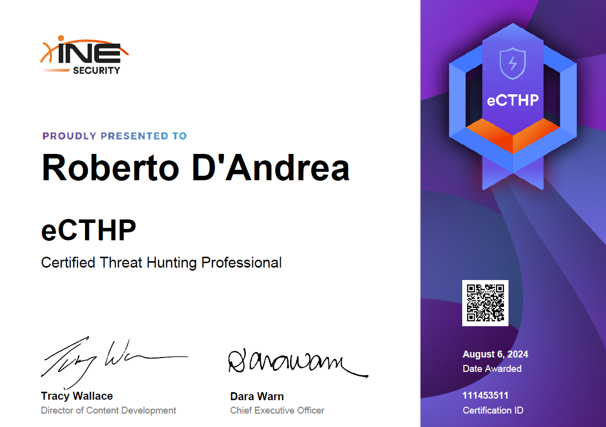

The **Certified Threat Hunting Professional v2 (eCTHPv2)** by INE is a certification designed for security professionals focused on threat hunting. 

This certification is ideal for security analysts and threat hunters who wish to learn in-depth techniques for identifying malicious activities across network and endpoint environments. Priced at **$399**, the certification includes a practical exam and requires a final report, to be completed within two days post-exam. 
This guide includes notes and an example of the exam I completed.

This certification is broken down into three main areas:

### Course Structure and Certification Details

1. **Introduction to Threat Hunting**:
    - This section introduces core **threat hunting** concepts, life cycles of threats, and detection methodologies. Key topics include identifying **Indicators of Compromise (IoC)** and building threat-hunting hypotheses.
    - A crucial part is understanding threat behaviors and utilizing frameworks like **MITRE ATT&CK** to create a structured approach.
2. **Hunting the Network & Network Analysis**:
    - This part focuses on network traffic analysis and techniques for spotting suspicious patterns. Practical insights are given into monitoring network data using **Splunk** and understanding packet analysis.
    - The module covers spotting lateral movement and data exfiltration signs.
3. **Hunting the Endpoint & Endpoint Analysis**:
    - Here, emphasis is on endpoint analysis, covering tools like **Volatility** for memory analysis and **ELK (Elastic)** for log analysis, focusing on detecting malware indicators and suspicious activity on endpoints.

💡
**Personal Notes on the Course Content**

> In this section, I’ve included some of my notes to help guide others studying for the eCTHPv2 certification. 
> These notes summarize key takeaways from each module, covering essential techniques, tools, and strategies for threat hunting within networks and endpoints. 
> [eCTHPv2 Notes](https://www.notion.so/eCTHPv2-Notes-3feb4008746f4cb6b1b37acbebbc130a?pvs=21)

### Exam Details

The eCTHPv2 exam consists of three **hands-on labs**:

- **Splunk**: For log monitoring and network traffic analysis.
- **Volatility**: For forensics and memory analysis.
- **ELK (Elastic)**: For system log management and analysis.

After completing these labs, you have **two days** to complete the exam and an additional **two days** to submit the final report, which must detail your findings and conclusions from the hunting activities.

### Tips for Success

Since you’re already familiar with **Splunk** and **ELK**, here are some focused tips:

1. **Review the MITRE ATT&CK Framework**: Get well-acquainted with common attack techniques. This framework will support you in your report, especially when describing threat-hunting processes.
2. **Maximize Tool Knowledge**: Even if you know Splunk and ELK well, delve deeper into filtering techniques, regex for complex queries, and setting up customized dashboards and alerts.
3. **Thorough Documentation**: During the labs, take meticulous notes. The final report should detail not just results but also your methodologies to demonstrate a structured approach.
4. **Time Management**: Plan each lab’s activities and reserve time for report review to meet the certification’s strict deadlines.
5. **Practice with Real Scenarios**: Aside from course materials, practice with realistic case studies to solidify your knowledge, especially in network and endpoint analysis.

[eCTHPv2_Letter_of_engagement](eCTHPv2_Letter_of_engagement.pdf)

### Conclusion

INE's eCTHPv2 provides significant hands-on experience in threat hunting, emphasizing proactive response to network and endpoint threats. By mastering tools like `Splunk`, `Volatility`, and `ELK`, this certification enhances your ability to detect and analyze anomalies in an enterprise setting. 
The hands-on labs and structured threat-hunting techniques make it a comprehensive choice for anyone serious about advancing their skills in cybersecurity and threat detection.
